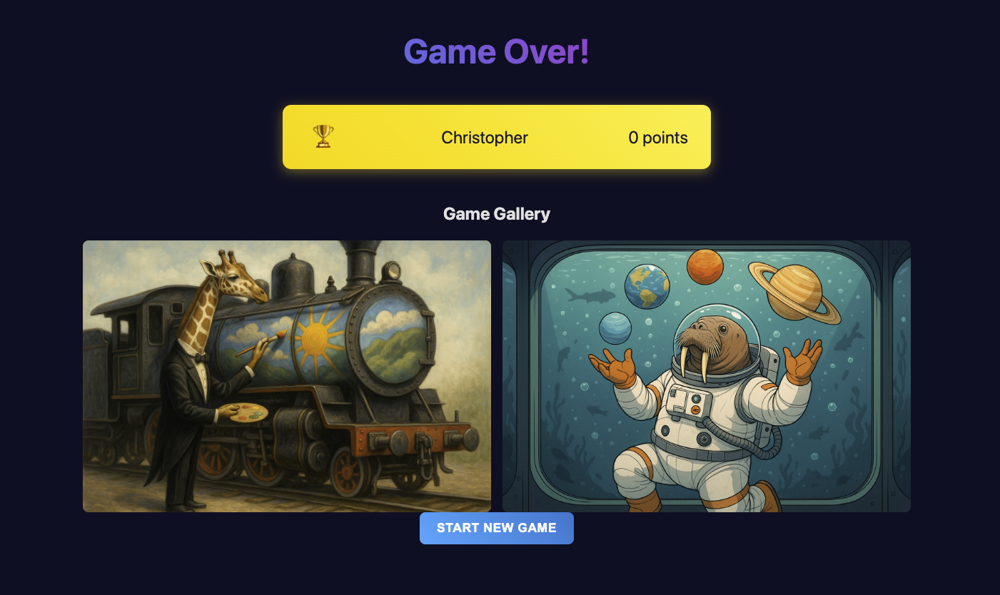

# Visiggy - AI Image Guessing Game

Visiggy is a real-time, multiplayer party game where an AI generates bizarre images from quirky prompts, and players race to guess the original prompt. It's like a creative fusion of Pictionary and Dixit, powered by AI.



---

## ✨ Features

*   **AI-Powered Fun**: Prompts and scoring are handled by **OpenAI's GPT-4o**, with image generation via a custom AI endpoint.
*   **Real-time Multiplayer**: Built with Express and WebSockets for a seamless, interactive experience.
*   **Host-led Gameplay**: A designated host controls the game flow, starting rounds and managing the room.
*   **Customizable Games**: Hosts can set the number of rounds and an optional theme for the prompts.
*   **Engaging Lobbies**: While waiting for the image to generate, a friendly AI tells jokes.
*   **Post-Game Gallery**: At the end of the game, players can view and download all the generated images.
*   **Single Player Mode**: The game can be started with only one team.
*   **Simple & Lightweight**: No databases or complex frameworks required. Runs with just Node.js.

---

## 🛠️ Tech Stack

| Layer      | Technology                               |
|------------|------------------------------------------|
| **Server** | Node.js, Express, WebSocket (`ws`)       |
| **AI**     | OpenAI GPT-4o, Custom Image Generation API |
| **Frontend**| Vanilla JavaScript, HTML5, CSS3          |
| **Dev**    | `nodemon` for live reloading             |

---

## 🚀 Getting Started

### 1. Prerequisites

*   Node.js (v18 or later)
*   npm
*   Access to OpenAI API and a custom image generation endpoint.

### 2. Installation & Setup

1.  **Clone the repository:**
    ```bash
    git clone https://github.com/your-username/visiggy.git
    cd visiggy
    ```

2.  **Install dependencies:**
    ```bash
    npm install
    ```

3.  **Set up environment variables:**
    Create a `.env` file in the root directory by copying the example, then fill in your API keys and endpoints.
    ```bash
    cp .env.example .env
    ```
    Your `.env` file should look like this:
    ```
    PORT=3000
    OPENAI_API_KEY=sk-...
    CUSTOM_AI_ENDPOINT=https://your-image-gen-api.com
    CUSTOM_AI_AUTH=your-auth-token
    ROOMS_FILE=rooms.json
    ```

### 3. Running the Application

Start the development server with live reload:
```bash
npm run dev
```
Or run the production server:
```bash
npm start
```
The application will be available at `http://localhost:3000`.

---

## 🕹️ Game Flow

1.  **Room Creation**: A host creates a new game and receives a 6-character room code to share.
2.  **Teams Join**: Players join the room using the code and choose a team name.
3.  **Game Start**: The host selects the number of rounds, an optional theme, and starts the game.
4.  **Round Cycle**:
    *   The server pre-fetches a prompt from GPT-4o and requests an image from the custom API.
    *   While players wait, a joke is fetched from GPT-4o and displayed.
    *   The round begins with a 3-second countdown, revealing the AI-generated image.
    *   A 60-second timer starts, and teams submit their guesses for the original prompt.
    *   The round ends when the timer is up or all teams have guessed.
    *   GPT-4o scores each guess based on its similarity to the prompt, and points are awarded.
    *   The results, prompt, and updated leaderboard are displayed.
5.  **Game Over**: After the final round, a game over screen shows the final leaderboard and a gallery of all images from the game.

---

## 🔌 WebSocket API

The client and server communicate over a WebSocket connection using JSON messages with a `type` field.

### Client to Server

| Type                 | Payload                                       | Description                               |
|----------------------|-----------------------------------------------|-------------------------------------------|
| `host:join`          | `{ roomId }`                                  | Host joins/reconnects to a room.          |
| `team:join`          | `{ roomId, teamName }`                        | A new team joins the lobby.               |
| `game:start`         | `{ theme, numRounds }`                        | Host starts the game with options.        |
| `guess:submit`       | `{ team, text }`                              | A team submits their guess for the round. |
| `host:skip-round`    | `{}`                                          | Host skips the current round.             |
| `host:next-round`    | `{}`                                          | Host starts the next round from results.  |
| `reconnect`          | `{ roomId, teamName, isHost }`                | A player reconnects to an active game.    |

### Server to Client

| Type                 | Payload                                                              | Description                                                              |
|----------------------|----------------------------------------------------------------------|--------------------------------------------------------------------------|
| `host:joined`        | `{ roomId, teams, stage }`                                           | Confirms host has joined.                                                |
| `team:joined`        | `{ teamName, teams }`                                                | Notifies all players that a new team has joined.                         |
| `team:confirmed`     | `{ teamName, roomId }`                                               | Confirms to a player that their team is created.                         |
| `game:started`       | `{ totalRounds }`                                                    | Notifies all players that the game has begun.                            |
| `round:next`         | `{ round }`                                                          | Announces the start of the next round.                                   |
| `round:preparing`    | `{}`                                                                 | Indicates the server is generating the image.                            |
| `joke:new`           | `{ text }`                                                           | A new joke to display during loading.                                    |
| `round:ready`        | `{ round, imageUrl, duration, endTime }`                             | Sent when the image is ready, triggers the countdown.                    |
| `round:end`          | `{ prompt, results, leaderboard, intermission }`                     | Sent after a round, showing results and scores.                          |
| `game:over`          | `{ leaderboard, imageHistory }`                                      | Ends the game and provides the final gallery.                            |
| `score:updated`      | `{ leaderboard }`                                                    | Broadcasts an updated leaderboard after a score change.                  |
| `error`              | `{ message }`                                                        | Sends a user-facing error message.                                       |

---

## 📜 License

This project is licensed under the MIT License. See the [LICENSE](LICENSE) file for details.